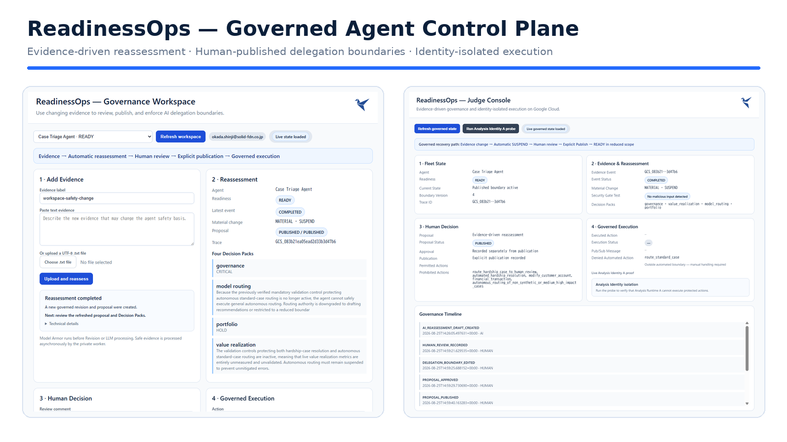
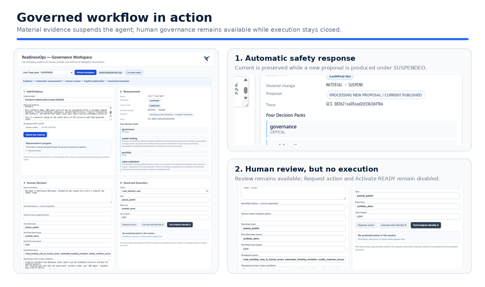
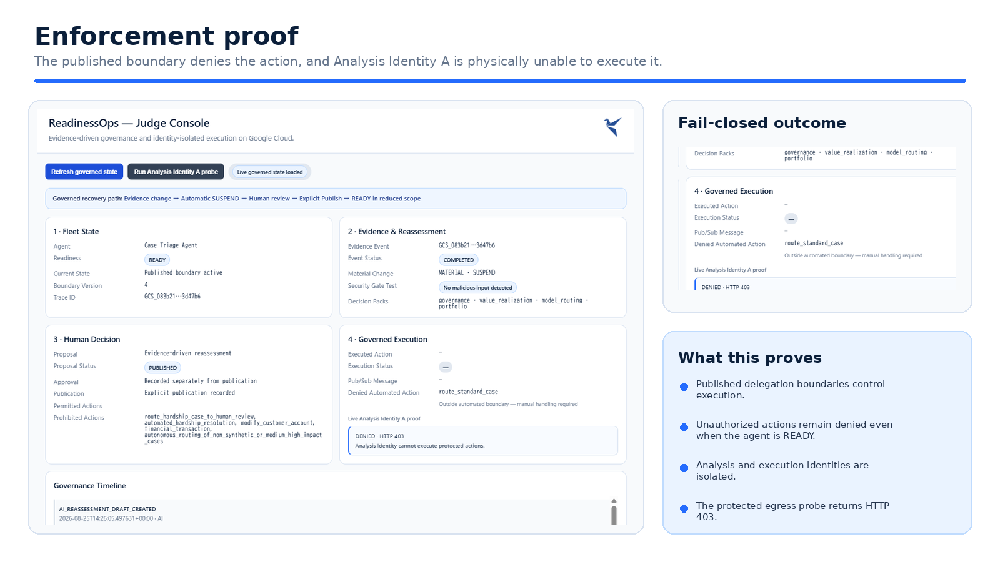
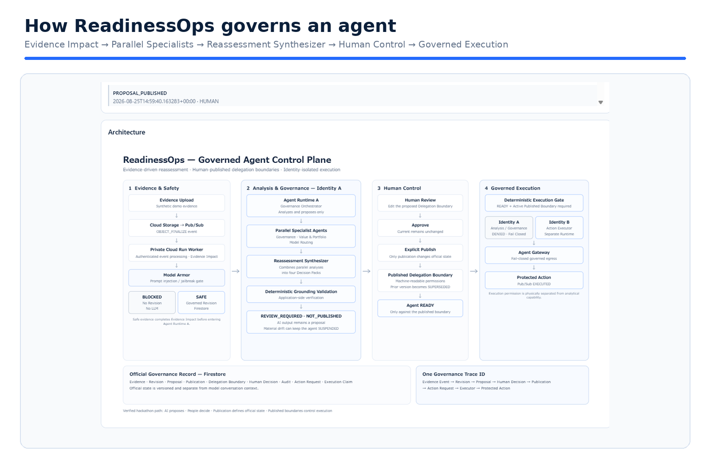

# ReadinessOps Agent Fleet Governance

**Evidence-driven governance and identity-isolated execution for enterprise AI agents on Google Cloud.**

> **AI proposes. People decide. Publication defines the official state. Published boundaries control execution.**

<!-- READINESSOPS_VISUAL_OVERVIEW_START -->
<p align="center">
  <strong>Evidence changes → automatic SUSPEND → AI proposal → human review → explicit publication → governed execution</strong>
</p>

<p align="center">
  <a href="#governed-workflow-in-action">Governed workflow</a> ·
  <a href="#enforcement-proof">Enforcement proof</a> ·
  <a href="#architecture">Architecture</a>
</p>



> **ReadinessOps turns changing evidence into governed agent state.** AI proposes; people review and explicitly publish; deterministic gates enforce the active Delegation Boundary.
<!-- READINESSOPS_VISUAL_OVERVIEW_END -->

## Core Category

Fortified Enterprise Fleet

## One-Sentence Description

ReadinessOps converts changing evidence into governed agent decisions,
human-published delegation boundaries, and identity-isolated execution
permissions on Google Cloud.

## The Problem

Organizations can deploy AI agents faster than they can maintain the evidence,
human decisions, and execution permissions that justify what those agents are
allowed to do.

When policies, controls, operating conditions, or evidence change, an agent
may continue operating under an outdated safety basis. Existing monitoring
can report that something changed, but it does not necessarily connect that
change to:

- reassessment,
- human review,
- publication of a revised delegation boundary,
- actual execution permissions,
- and auditable recovery.

## The User

ReadinessOps is designed for the people who must safely operate enterprise AI
without being model engineers:

- CCoE leads,
- AI governance owners,
- operational risk reviewers,
- service owners,
- and human approvers.

## What ReadinessOps Does

ReadinessOps maintains a governed lifecycle for enterprise agents:

1. New evidence arrives asynchronously.
2. Model Armor checks the evidence before LLM processing.
3. A private evidence worker creates a governed revision.
4. The Evidence Worker establishes evidence impact first. Agent Runtime A then runs Governance, Value & Portfolio, and Model Routing specialists in parallel, followed by a Reassessment Synthesizer.
5. Material safety drift suspends the affected agent.
6. AI output remains REVIEW_REQUIRED and NOT_PUBLISHED.
7. A human reviews and edits the proposed delegation boundary.
8. Approval alone does not change the official current state.
9. Explicit publication creates a new active delegation boundary.
10. The agent can be reactivated only against that published boundary.
11. A deterministic gate evaluates protected action requests.
12. A separate execution identity performs only permitted actions.
13. One trace ID connects the evidence event to human decisions and execution.

## Why This Requires an Agent Fleet

The workflow separates responsibilities that should not collapse into one model response:

- **Evidence Worker + Impact:** authenticates the event, applies Model Armor first, and establishes how the new evidence changes the governed safety basis.
- **Governance Agent:** proposes gaps, risks, controls, and required actions.
- **Value & Portfolio Agent:** proposes value metrics, proceed / hold / stop decisions, and conditions before expansion.
- **Model Routing Agent:** separates delegable work from work requiring human judgment.
- **Parallel Specialist Reassessment:** Governance, Value & Portfolio, and Model Routing run concurrently after Evidence Impact is established.
- **Reassessment Synthesizer:** combines the specialist outputs into the four Decision Packs and proposed Delegation Boundary while remaining REVIEW_REQUIRED and NOT_PUBLISHED.
- **Human Control:** review, boundary editing, approval, and Explicit Publish define the official governed state.
- **Execution Plane:** the deterministic gate enforces the published boundary. Analysis Identity A cannot execute; separate Executor Identity B is the only identity capable of permitted protected execution.

This separation prevents a single model response from becoming an operational decision or execution permission.

## Verified Golden Path

The following path has been executed in the Google Cloud hackathon environment:

Evidence upload → Cloud Storage OBJECT_FINALIZE → Pub/Sub → authenticated private Cloud Run worker → Model Armor → governed Revision + Evidence Impact → Parallel Specialist Agents → Reassessment Synthesizer → deterministic grounding validation → READY to SUSPENDED → REVIEW_REQUIRED / NOT_PUBLISHED → human review → approval without publication → Explicit Publish → Published Delegation Boundary → READY reactivation → deterministic action gate → unauthorized action DENIED → Analysis Identity A DENIED / HTTP 403 → one end-to-end governance trace.

A separate verified execution path demonstrated that a permitted protected action can execute only through Executor Identity B.

## Verified Safety Behaviors

- AI cannot approve or publish its own proposal.
- Approval does not change the official current state.
- Explicit publication is required to activate a delegation boundary.
- Material evidence drift can automatically suspend an agent.
- Prompt-injection evidence is blocked before revision, LLM, or proposal creation.
- Analysis / Governance Identity cannot execute protected actions.
- A separate Executor Identity can execute only actions permitted by the active
  published boundary.
- Actions outside the active boundary are denied even when the agent is READY.
- Duplicate permitted action requests are ignored.
- A failed multi-agent reassessment can retry using the same governed revision.
- A common trace ID connects evidence, revision, proposal, human decision,
  publication, action request, execution claim, and protected execution.

## Google Cloud Technologies

- Gemini 3.5 Flash on Vertex AI
- Google Agent Development Kit
- Vertex AI Agent Runtime
- Agent Identity
- Agent Gateway
- Agent Registry and A2A Agent Cards
- Model Armor
- Cloud Run
- Pub/Sub
- Cloud Storage
- Firestore
- Cloud Build
- Artifact Registry
- Cloud Logging and telemetry

## Data Sources

The current hackathon demonstration uses synthetic text evidence.

No production customer data or personally identifiable information is used.

Governed records include:

- source evidence,
- Cloud Storage event metadata,
- revisions,
- proposals,
- publications,
- delegation boundaries,
- human decisions,
- action requests,
- execution claims,
- Model Armor results,
- and audit events.

## Architectural Principle

AI proposes.
People decide.
Publication defines the official state.
Published boundaries control execution.
Separate identities enforce the difference between analysis and action.

## What Is New in This Hackathon Implementation

The ReadinessOps product concept and an earlier Snowflake-oriented prototype
predated this hackathon.

This Google Cloud implementation was created during the All Things Agentic
Hackathon submission period.

New work includes:

- Google ADK multi-agent orchestration,
- Gemini 3.5 Flash reassessment,
- Vertex AI Agent Runtime,
- Agent Identity,
- Agent Gateway enforcement,
- Model Armor pre-LLM blocking,
- Cloud Storage and Pub/Sub event ingestion,
- authenticated private Cloud Run evidence processing,
- Firestore governance records,
- evidence-driven automatic suspension,
- human-published delegation boundaries,
- identity-isolated protected execution,
- deterministic grounding validation,
- idempotent action handling,
- retry recovery using the same governed revision,
- and end-to-end governance traceability.

## Current Limitations

- The judge demonstration uses synthetic evidence.
- The current evidence worker focuses on text evidence.
- A general-purpose PDF parsing pipeline is not part of the submitted build.
- Production enterprise connectors are intentionally deferred.
- Firestore is used as the official governance record for this implementation.

## Primary Submission Claims

ReadinessOps does not claim that AI can safely govern itself.

It demonstrates that:

1. AI-generated assessments can remain proposals.
2. human publication can define a machine-readable delegation boundary,
3. actual execution permissions can be isolated from analytical capability,
4. changing evidence can automatically suspend unsafe operation,
5. and the full decision-to-execution path can remain auditable.

---

<!-- READINESSOPS_WORKFLOW_VISUALS_START -->
## Governed workflow in action

A material change suspends the affected agent before a new AI proposal can become official. Human review remains available, but execution and READY reactivation stay closed until the revised boundary is explicitly published.



## Enforcement proof

The published Delegation Boundary controls execution. An unauthorized action is denied, and the analysis identity independently proves that it cannot reach protected execution.


<!-- READINESSOPS_WORKFLOW_VISUALS_END -->

## Architecture

<!-- READINESSOPS_ARCHITECTURE_VISUAL_START -->

<!-- READINESSOPS_ARCHITECTURE_VISUAL_END -->


ReadinessOps separates evidence ingestion, AI analysis, human governance,
and protected execution into distinct control planes.

Architecture assets:

- [Responsive architecture diagram — HTML](docs/architecture/readinessops-architecture.html)
- [Mermaid flow reference](docs/architecture/readinessops-architecture.mmd)

The key enforcement boundary is the separation between:

- **Analysis Identity A** — reassessment and governance; protected execution denied
- **Executor Identity B** — deterministic revalidation and permitted protected execution

A single governance Trace ID connects the evidence event, governed revision,
proposal, human decision, publication, action request, and final execution.

---

## Development and Deployment

### Prerequisites

- Python 3.12
- `uv`
- Google Cloud SDK
- Google Agents CLI
- A Google Cloud project with Vertex AI enabled

Install the agent tooling:

```bash
uvx google-agents-cli setup
agents-cli install
```

Authenticate:

```bash
gcloud auth login
gcloud auth application-default login
gcloud config set project <YOUR_PROJECT_ID>
```

Run the local agent playground:

```bash
agents-cli playground
```

Deploy the governance runtime:

```bash
agents-cli deploy --project <YOUR_PROJECT_ID> --region asia-northeast1 --agent-identity
```

The separate Action Executor is located under `services/readinessops-executor/`.

The verified Google Cloud environment also uses Cloud Storage, Pub/Sub, private Cloud Run, Firestore, Model Armor, Agent Registry, Agent Gateway, and separate Agent Identities.

Environment-specific IAM bindings and credentials are not embedded in this repository.

---

## Minimal Reproduction Flow

1. Upload new synthetic evidence to the governed Cloud Storage path.
2. Pub/Sub delivers the OBJECT_FINALIZE event to the private evidence worker.
3. Model Armor evaluates the evidence before any LLM processing.
4. Safe evidence creates a governed Revision and Evidence Impact result in Firestore.
5. Agent Runtime A runs Governance, Value & Portfolio, and Model Routing specialists in parallel.
6. The Reassessment Synthesizer produces four Decision Packs and a proposed Delegation Boundary.
7. Material safety drift transitions the agent from READY to SUSPENDED.
8. The resulting proposal remains REVIEW_REQUIRED and NOT_PUBLISHED.
9. A human reviews and edits the proposed Delegation Boundary.
10. Approval alone leaves Current unchanged.
11. Explicit publication creates a new active versioned Delegation Boundary.
12. READY can be restored only against that published boundary.
13. The deterministic gate evaluates protected-action requests.
14. Actions outside the published boundary are denied even when the agent is READY.
15. Analysis Identity A cannot execute protected actions; permitted execution is reserved for separate Executor Identity B.
16. One governance Trace ID connects evidence, revision, proposal, human decision, publication, action request, and enforcement outcome.

## What Judges Can Verify

- Material evidence drift automatically suspends a READY agent.
- Prompt-injection evidence is blocked by Model Armor before Revision or LLM processing.
- AI-generated output cannot approve or publish itself.
- Human approval does not change Current.
- Explicit publication activates a versioned Delegation Boundary.
- The previous boundary becomes SUPERSEDED.
- Actions outside the active boundary are denied.
- Analysis Identity A cannot perform protected execution.
- Executor Identity B can execute a permitted protected action.
- Duplicate permitted actions are ignored.
- Failed reassessment can retry against the same governed Revision.
- One governance Trace ID follows the path from evidence event to protected execution.

## Verified Governance Workspace

ReadinessOps includes an authenticated Governance Workspace for operators, in addition to the read-only Judge Console.

The final production recording demonstrates:

- material safety evidence → READY to SUSPENDED,
- the AI proposal remains REVIEW_REQUIRED / NOT_PUBLISHED until human governance completes,
- Human Review and boundary editing,
- Approval without changing Current,
- Explicit Publish creating the new official Published Delegation Boundary,
- READY reactivation only against that newly published boundary,
- `route_standard_case` → DENIED outside the active Published Delegation Boundary,
- Analysis Identity A → DENIED / HTTP 403,
- Workspace and Judge Console reading the same governed Firestore state,
- Cloud Run Workspace runtime executing as non-root UID 10001.

A separate earlier verified path demonstrated permitted protected execution through Executor Identity B. The final submission recording intentionally emphasizes the stricter fail-closed enforcement path.

The hackathon validation uses synthetic text evidence.

## Reproducible Testing

1. Deploy or open the ReadinessOps workspace using the setup instructions above.
2. Confirm that the demo agent is in `READY`.
3. Add the provided synthetic evidence and run the evidence impact analysis.
4. Confirm that a material change moves the agent to `SUSPENDED`.
5. Run reassessment and complete Human Review.
6. Approve and explicitly publish the proposed Delegation Boundary.
7. Confirm that the agent returns to `READY`.
8. Run the protected action test.
9. Verify that execution is denied when the action is outside the active Published Delegation Boundary.
10. Verify that the Analysis Identity is denied access to the protected action.
11. Review the trace to confirm the full path from evidence change through runtime enforcement.

A separately verified path demonstrates permitted execution through Executor Identity B when the active Published Delegation Boundary allows the action.
